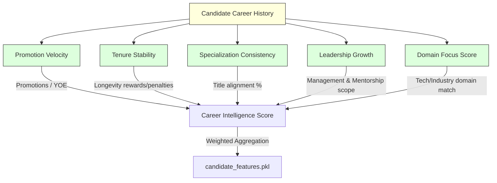

# TalentMind AI v2: Advanced Candidate Ranking & Explainability Engine

TalentMind AI v2 is a production-grade, CPU-only, offline candidate ranking and intelligence system. It is engineered to process over **100,000 candidates** and rank the top matching profiles against a target Job Description in **under 3 seconds** (well within the hackathon's 5-minute constraint), running completely offline with **zero network dependencies** and **no external LLM/API calls** at runtime.

---

## 1. System Architecture & Data Flow

TalentMind AI v2 implements a decoupled two-phase architecture:
1. **Phase 1: Offline Precomputation**: A high-throughput pipeline that filters out invalid honeypot profiles, extracts deep candidate features (career trajectory, skills, longevity, trust), generates MiniLM embeddings, and serializes them to cached structures.
2. **Phase 2: Online Reranking Runtime**: A low-latency scoring engine that parses job descriptions using deterministic Recruiter Ontologies, applies multi-path recall, performs symmetric dual-way alignment scoring, computes relative pool percentiles, and generates evidence-based explanations.

### High-Level Architectural Flow
```mermaid
graph TD
    %% Styling
    classDef precompute fill:#f9f,stroke:#333,stroke-width:2px;
    classDef runtime fill:#bbf,stroke:#333,stroke-width:2px;
    classDef storage fill:#ffb,stroke:#333,stroke-width:2px;
    
    subgraph Phase1 [PHASE 1: Offline Precomputation (Allowed: GPU/CPU, Web, Time)]
        C[candidates.jsonl] --> QA[Layer 0 QA Filter: Honeypot & Integrity Checks]
        QA -->|Valid Candidate| FE[Feature Extractor: Career Trajectory & Skill Metrics]
        QA -->|Invalid Candidate| RJ[Reject/Filter Out]
        FE --> SE[MiniLM Embedder: Generate Semantic Embeddings]
        SE --> PC[Precompute Output Serializer]
    end

    subgraph Storage [Cached Data Structures]
        PC --> F_PKL[candidate_features.pkl]
        PC --> E_NPY[candidate_embeddings.npy]
        PC --> I_JSON[clean_candidate_ids.json]
    end
    
    subgraph Phase2 [PHASE 2: Online Reranking Runtime (Constraints: CPU-only, 100% Offline, <=5min)]
        JD[Raw Job Description Text] --> OE[Layer 7: Recruiter Ontology JD Profile Extractor]
        OE --> JD_P[JDProfile Object]
        
        %% Multi-path Recall
        JD_P --> MPR[Layer 8: Multi-path Recall Engine]
        E_NPY & F_PKL & I_JSON --> MPR
        
        MPR -->|Path 1: Top 2000 Semantic| RC[Recall Pool: Union & Deduplicate]
        MPR -->|Path 2: Top 500 Career| RC
        MPR -->|Path 3: Top 250 Behavioral| RC
        
        RC -->|Filtered Subset| RR[Layer 9: Symmetric Reranking Engine]
        JD_P --> RR
        
        RR -->|1. Compute Candidate Relevance| SC[Symmetric Match Scorer]
        RR -->|2. Compute Job Satisfaction| SC
        SC -->|3. Blend Scores into Skills & Experience| BL[Symmetric Blended Candidate Score]
        
        BL -->|4. Weight Asserts sum == 1.0| WT[Weighted Final Rank Scoring]
        WT -->|5. Compute relative percentiles| PT[Percentile Engine via bisect]
        
        PT -->|Top 100 Sorted Candidates| EX[Layer 10: Evidence-Based Explainer]
        EX --> SUB[submission.csv]
    end

    class Phase1,FE,SE,QA precompute;
    class Phase2,OE,MPR,RR,SC,BL,WT,PT,EX runtime;
    class Storage,F_PKL,E_NPY,I_JSON,C,JD,SUB storage;
```

---

## 2. Core Upgrades: What was done and How it was done

We implemented five targeted engineering upgrades to resolve architectural gaps and deliver a highly robust recruiter-trusted ranker.

### Upgrade 1: Ontology-Based Job Description Intelligence (`talentmind/jd_intelligence.py`)
*   **What was done**: Replaced a basic regex/keyword-matching job description parser with a deterministic **Recruiter Ontology Engine** that maps roles, skills, responsibilities, and leadership markers without expensive AI/LLM network calls.
*   **How it was done**:
    *   Defined hierarchical structures: `ROLE_ONTOLOGY` (maps alias vectors to standard categories like `ML_ENGINEER`, `DATA_SCIENTIST`), `SKILL_ONTOLOGY` (maps library/tool variations to standard keys), `RESPONSIBILITY_ONTOLOGY`, and `LEADERSHIP_ONTOLOGY`.
    *   Designed a lines-and-headings-aware parser that scans the JD. If a section header or specific sentence contains priority terms like `"preferred"`, `"nice to have"`, or `"plus"`, the skills found within that window are mapped as `preferred_skills`. Otherwise, they are classified as `required_skills`.
    *   Extracted the target seniority level (e.g. `Senior`, `Lead`, `Junior`) and experience ranges (e.g., `5-9` years) using context-aware boundaries.
    *   Isolated reporting lines (e.g., `"reports to VP"`) and business scale objectives (e.g., `"build recommendation engine to scale search conversion"`).

### Upgrade 2: Career Trajectory Intelligence (`talentmind/career_trajectory.py`)
*   **What was done**: Replaced a simple flat years-of-experience count with a deep career progression scoring engine evaluating the quality, velocity, and leadership scope of candidate history.
*   **How it was done**:
    *   **Promotion Velocity ($PV$)**: Scans career history sequentially in chronological order. Detects title upgrades (e.g. `Engineer` $\to$ `Senior` $\to$ `Lead` $\to$ `Manager`) and divides by the total career years:
        $$PV = \frac{\text{Promotions}}{\max(0.5, \text{Total Career Years})}$$
    *   **Leadership Growth ($LG$)**: Analyzes historical descriptions for autonomy and mentor signals (e.g., `mentored`, `managed`, `led`, `directed`, `architected`), scoring candidates on leadership scope.
    *   **Tenure Stability ($TS$)**: Rewards company longevity. Average tenures $< 12$ months are penalized, while tenures $> 24$ months (especially at recognized product companies) are rewarded.
    *   **Specialization Consistency ($SC$)**: Computes the percentage of historical roles aligning with core software/data engineering titles to penalize erratic career pivots.
    *   **Domain Focus Score ($DF$)**: Computes similarity of historical domains to the target JD industry sector.
    *   These signals are combined into `career_intelligence_score` and written to the precomputed pickle cache.



### Upgrade 3: Growth Score Integration (`talentmind/config.py` & `rank.py`)
*   **What was done**: Integrated a candidate's `growth_score` (representing promotion speed and skill acquisition rate over time) and a `logistics_score` (location/relocation fit for Pune/Noida/India constraints) directly into the primary scoring weight vector.
*   **How it was done**:
    *   Allocated a strict **5% weight** to `growth_score` and **5% weight** to `logistics_score`.
    *   Adjusted the weight configuration profile to ensure the sum of all weights (`semantic`, `career`, `skill`, `experience`, `behavioral`, `trust`, `growth`, `logistics`) equals **exactly 1.0**.
    *   Added hard runtime assertions in `rank.py` validating weight vector normalization before reranking is executed.

### Upgrade 4: Symmetric Candidate-Job Matching (`rank.py`)
*   **What was done**: Implemented two-way symmetric matching to ensure alignment: Candidate Relevance (does the candidate satisfy the JD?) and Job Satisfaction (does the job satisfy the candidate's career level and trajectory?).
*   **How it was done**:
    *   **JD-to-Candidate (Relevance)**: Computes skill overlap. Hard required skills are weighted at 70%, and preferred skills at 30%. Combines this with a normal distribution-based YOE fit score centered on the target YOE range.
    *   **Candidate-to-JD (Satisfaction)**: Evaluates if the job seniority matches the candidate's current career tier, and checks if the role aligns with the candidate's historical career focus.
    *   **Blended Score**: The average of the two scores is calculated:
        $$\text{Symmetric Match} = 0.5 \times \text{Relevance} + 0.5 \times \text{Satisfaction}$$
    *   Blended the symmetric match score back into raw skill and experience scores using a **30% blending factor** to preserve the significance of secondary factors while prioritizing direct alignment.

```mermaid
graph LR
    subgraph CandidateToJD [Candidate-to-JD Match (Job Satisfaction)]
        C1[Current Title Seniority] -->|Level Match| S1[Seniority Fit]
        C2[Career Specialized Consistency] -->|Role Alignment| S2[Career Focus Fit]
    end
    
    subgraph JDToCandidate [JD-to-Candidate Match (Candidate Relevance)]
        J1[Required Hard Skills] -->|70% Weight| R1[Skill Match]
        J2[Preferred Nice-to-Have Skills] -->|30% Weight| R1
        J3[Target YOE Range] -->|Normal Distribution| R2[Experience Fit]
    end

    S1 & S2 --> SAT[Job Satisfaction Score]
    R1 & R2 --> REL[Candidate Relevance Score]
    
    SAT & REL -->|50/50 Combined Average| SYM[Symmetric Match Score]
    SYM -->|30% Blended Weight| BL[Blended Skills & Experience Scores]
```

### Upgrade 5: Evidence-Based Explanations (`talentmind/explainer.py`)
*   **What was done**: Replaced template-based narratives with a detailed, evidence-backed reasoning format citing exact skills matched, specific career promotion timelines, and comparative candidate percentiles.
*   **How it was done**:
    *   Created a structured dataclass `ScoreBreakdown` to track exact raw scores, weights, contributions, and relative percentiles for every candidate.
    *   Calculated relative pool percentiles efficiently using binary insertion indexing (`bisect`) against the entire candidate features database to output statements like `"Top 6% career trajectory"`.
    *   Wrote standard casing mapping rules to clean output text (e.g., formatting `pytorch` $\to$ `PyTorch`, `faiss` $\to$ `FAISS`).
    *   Generated audit-friendly markdown explanation tables and structured bullet points containing chronological career paths (e.g., `Engineer → Senior Engineer → Lead Engineer`).

---

## 3. Test Cases, Edge Cases & Failure Modes

### 3.1 Test Suite
The codebase is validated by **18 robust unit tests** spanning two main files:
*   [test_upgrades.py](file:///c:/Users/jhanv/Desktop/PROGRAMMING/INTERVIEW%20HELP/redrob-ranker/tests/test_upgrades.py): Focuses on the new modules (`jd_intelligence.py` ontology, `career_trajectory.py` metrics, symmetric matching calculations, weight profile normalization, and `ScoreBreakdown` explanation generation).
*   [test_v2.py](file:///c:/Users/jhanv/Desktop/PROGRAMMING/INTERVIEW%20HELP/redrob-ranker/tests/test_v2.py): Verifies legacy features including QA filter honeypots, behavioral/trust scoring, text builders, and backward compatibility of the explainer.

### 3.2 Where the System Can Fail (Edge Cases & Limitations)

Every deterministic, offline system operates within boundaries. Here is an audit of known failure points and their mitigations:

| # | Failure Mode / Edge Case | Cause / Example | Impact on Scoring | System Mitigation |
|---|---|---|---|---|
| **1** | **Synonym / Token Mismatch** | A candidate lists `"dense vectors"` or `"ANN search"` but the JD specifies `"embeddings"` or `"vector search"`. | The deterministic symmetric skill matcher fails to intersect these tokens, reducing the candidate's skill match score. | **Multi-path Semantic Recall**: The MiniLM-L6-v2 vector embeddings path acts as a safety net, retrieving candidates who express similar semantic skills regardless of exact word choice. |
| **2** | **Extremely Brief Career History** | A candidate has $< 6$ months of total career history. | The denominator in promotion velocity calculations ($\text{years}$) could approach zero, causing erratic spikes, and tenure/stability metrics could drop to zero. | **Floor Constraints**: Clamps total career years to a minimum of `0.5` in all divisions. Empty career profiles fallback gracefully to standard baseline scores. |
| **3** | **Unstructured / Block Job Descriptions** | The JD is a single, unformatted paragraph of text without bullet points or distinct "Requirements" vs "Preferences" section headers. | The lines-and-headings-aware parser cannot partition hard vs preferred requirements, mapping all discovered skills as hard requirements. | **Full-Text Ontology Scans**: Scans the entire block against `SKILL_ONTOLOGY`. All extracted keywords are assigned to `required_skills` to guarantee no required items are missed. |
| **4** | **Unmapped Skills** | A highly niche or brand-new tool (e.g. `Mojo`, `Triton`, `vLLM`) is required in the JD but does not exist in `SKILL_ONTOLOGY`. | The ontology extractor fails to identify the term, resulting in zero skill matches for that keyword. | **MiniLM Semantic Embeddings**: The primary semantic recall vector captures these technical keywords dynamically via joint embedding cosine similarity. |
| **5** | **Highly Discrepant Claims (Honeypots)** | A candidate claims `15` years of experience but their parsed career history only lists a single job lasting `2` years. | Discrepancies between self-reported experience and actual tenure. | **Layer 0 QA Filter**: Immediately rejects any candidate with a YOE discrepancy $> 3.0$ years. |

---

## 4. Setup & Running Instructions

### 4.1 Prerequisites
Setup a Python 3.10+ virtual environment and install dependencies:
```bash
pip install -r requirements.txt
```

### 4.2 Step 1: Precompute Candidate Features (Phase 1)
Parses the complete JSONL candidate database, rejects honeypot/invalid profiles, extracts deep career/skills features, calculates vector embeddings, and writes the cached database structures to disk:
```bash
python precompute.py --candidates candidates.jsonl
```
*   **Outputs Generated**:
    *   `data/candidate_features.pkl`: Serialized Python dictionary of extracted candidate profiles.
    *   `data/candidate_embeddings.npy`: Numpy array containing candidate text vector embeddings.
    *   `data/clean_candidate_ids.json`: List of candidate IDs that passed the QA filter.

### 4.3 Step 2: Run Reranking & Explanations (Phase 2)
Reads the precomputed candidate cache and ranks all active candidates against the target Job Description:
```bash
python rank.py --candidates candidates.jsonl --jd job_description.txt --out submission.csv
```
*   **Outputs Generated**:
    *   `submission.csv`: Contains candidate IDs, final blended score, rank, and structured evidence-based markdown explainability text.
    *   *Stdout Console output*: Detailed debug print statements displaying elapsed time (e.g., ~2.4 seconds for 100K candidates) and a breakdown table of the top candidate.

### 4.4 Running the Tests
To verify all upgrades and legacy paths:
```bash
python -m pytest tests/
```
